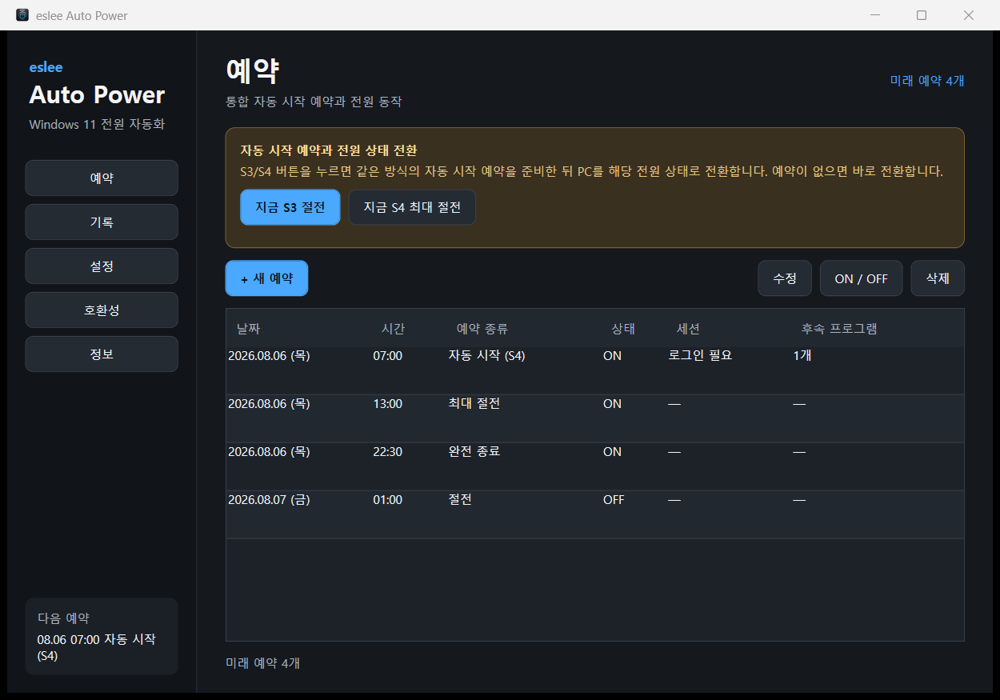
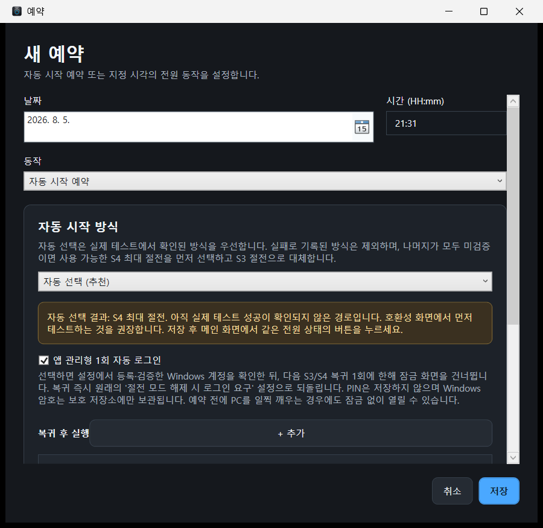
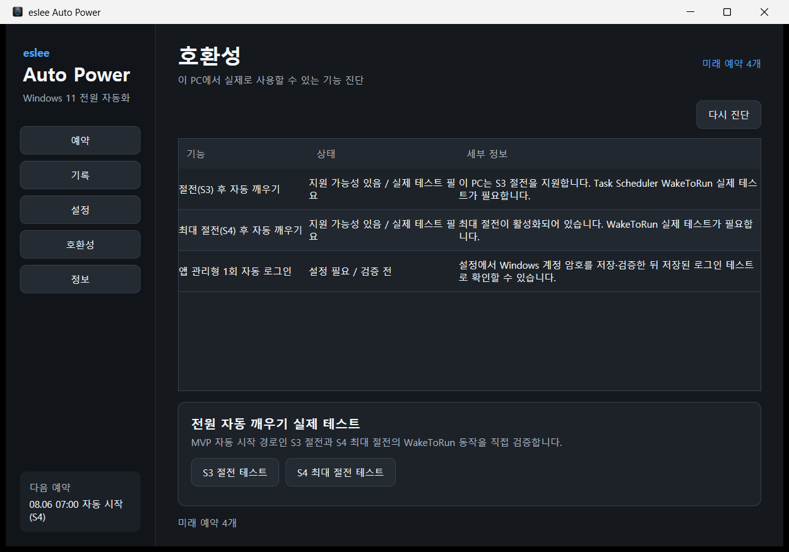
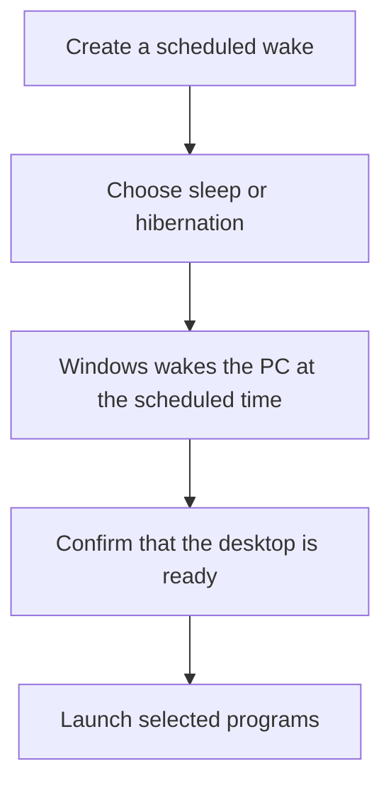
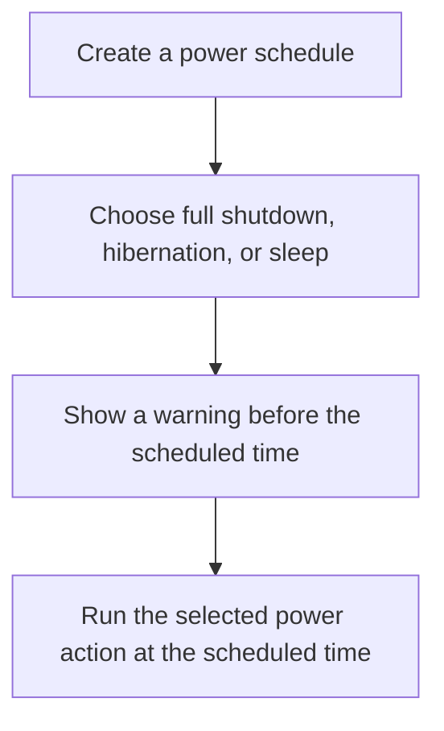

# eslee Auto Power

eslee Auto Power is a Windows 11 app that can wake your PC at a chosen time or schedule a full shutdown, hibernation, or sleep. It can also launch selected programs after the PC wakes.

Documentation: [한국어](README.md) · **English**

## Download the latest installer

Open the [latest GitHub Release](https://github.com/esleeeeee/eslee-auto-power/releases/latest) and download the English installer whose name ends in `-en-setup.exe`.

`Source code (zip)` and `Source code (tar.gz)` are developer archives, not installers. Most users should run the `-en-setup.exe` file.

The app supports Windows 11 x64 only.

## What you can do

- Wake the PC before work or at another scheduled time
- Shut down the PC automatically in one or two hours
- Enter hibernation or sleep at a chosen time
- Launch selected work apps after the PC wakes
- Review upcoming schedules and execution results in one place



## First-time setup

A typical scheduled-wake setup looks like this:

> Install → Check compatibility → Create a schedule → Choose scheduled wake → Set the date and time → Choose sleep or hibernation → Save → Put the PC into the selected state

1. Install and open eslee Auto Power.
2. Open `Compatibility` and check whether this PC can wake from sleep or hibernation. Running the available real wake test is recommended.
3. Open `Schedules` and select `+ New schedule`.
4. Choose `Scheduled wake` as the action.
5. Set the date and time.
6. Choose `Automatic (recommended)`, `Sleep (S3)`, or `Hibernation (S4)`.
7. Select `Save`.
8. Follow the prompt to put the PC into the selected power state. You can also do this later with `Enter S3 sleep now` or `Enter S4 hibernation now` on the main screen.

Save any unsaved work before entering sleep or hibernation.



### Optional: app-managed one-time sign-in

Use this only when you want to skip the lock screen once after a scheduled wake. It is not required for normal installation or scheduling.

- Account setup is needed only for schedules that enable `App-managed one-time sign-in`.
- In `Settings`, save and validate the Windows user name and **Windows account password**.
- Windows Hello PINs are never stored or used.
- The option applies to the next resume only and is best suited to a physically secure PC.

## Wake the PC at a scheduled time

Saving a wake schedule is only the first part. Before the scheduled time, leave the PC in the same sleep or hibernation mode selected by the schedule.

1. Select `+ New schedule`, then choose `Scheduled wake`.
2. Set the date, time, and power mode, then select `Save`.
3. On the main screen, use the matching `Enter S3 sleep now` or `Enter S4 hibernation now` button.
4. Windows wakes the PC at the scheduled time.
5. After the desktop is ready, linked programs run using their configured order and delay.

`Automatic (recommended)` chooses an available mode using the compatibility results. If you select a specific mode, use the matching button on the main screen.

A fully shut-down PC cannot be turned back on by this app. Leave the PC in sleep or hibernation when you need scheduled wake.

## Schedule shutdown, hibernation, or sleep

1. Select `+ New schedule`.
2. Choose `Full shutdown at scheduled time`, `Enter hibernation at scheduled time`, or `Enter sleep at scheduled time`.
3. Set the date and time, then select `Save`.

When any of these three actions is selected, the editor also shows `In 1 hour` and `In 2 hours`. The selected offset is calculated from the local time when you click the button, and you can still edit the date and time before saving.

A warning appears five minutes before a scheduled power action. Closing the warning or leaving it unanswered keeps the original schedule.

## Quickly schedule shutdown from the tray

The quick commands also work while the main window is closed and the app is running only in the system tray.

1. Right-click the eslee Auto Power icon in the Windows notification area.
2. Select `Shut down in 1 hour` or `Shut down in 2 hours`.
3. The full-shutdown schedule is created without a confirmation dialog.
4. A tray notification shows the actual scheduled time.

These commands do not shut down the PC immediately. They create a full-shutdown schedule for the selected time later.

## Run programs after the PC wakes

You can attach follow-up programs to a scheduled wake.

1. Create or edit a scheduled wake.
2. Under `Run after resume`, select `+ Add`.
3. Choose the executable and a delay after the desktop becomes ready.
4. If needed, open `Advanced options` and enable `Run as administrator`.

The delay starts when the Windows desktop is actually ready, not at the planned wake time. Multiple programs can use the same delay, and one failed program does not stop the others.

Use administrator access only for programs you trust.

## Which power state should you choose?

| What you need | Recommended choice | What to know |
|---|---|---|
| You will be away briefly and want a quick return | Sleep (S3) | Resumes quickly but continues to use some power. Supported PCs can use it for scheduled wake. |
| You will be away for several hours and need a later scheduled wake | Hibernation (S4) | Uses very little power and preserves your session. Windows hibernation and PC support are required. |
| You do not need another scheduled wake and want the PC fully off | Full shutdown (S5) | The app cannot turn the PC back on from this state. |

Available sleep modes vary by PC, so check `Compatibility` before creating your first wake schedule.



## Important notes

- Windows 11 x64 is required.
- Scheduled wake can depend on PC firmware, Windows wake-timer settings, and vendor power policies.
- If hibernation is unavailable, Windows hibernation may be disabled or unsupported on the PC.
- A scheduled wake cannot turn the PC back on after full shutdown.
- Check for unsaved work before sleep, hibernation, or full shutdown.
- Release installers are currently unsigned, so Windows SmartScreen may display a warning.
- With `App-managed one-time sign-in`, manually waking the PC before the schedule may also skip the lock screen.

## How it works

### Scheduled wake



### Scheduled power action



For details about schedule storage, Windows task registration, and recovery, see the [architecture documentation](docs/architecture.md).

## Troubleshooting

### The PC did not wake at the scheduled time

- Make sure the schedule mode matches the button used to put the PC into sleep or hibernation.
- Open `Compatibility` and run the real wake test again for that mode.
- Laptop wake-timer behavior may change depending on whether external power is connected.
- Check the sleep and wake settings in the PC manufacturer's BIOS or UEFI.

### Sleep or hibernation is unavailable

Open `Compatibility` to see which states the PC currently supports. If hibernation is disabled, you may need to enable the Windows hibernation feature using the instructions shown by the app. The app does not change that setting automatically.

### Windows asks for a password after wake

This is normal Windows lock-screen behavior. Sign in to continue. If one future wake must skip the lock screen, enable `App-managed one-time sign-in` for that schedule and register the Windows account password in `Settings`. Windows Hello PINs cannot be used for this option.

### Windows SmartScreen displays a warning

The installer is not currently code-signed. First confirm that the file came from the official [GitHub Releases](https://github.com/esleeeeee/eslee-auto-power/releases/latest) page, then use `More info` to decide whether to run it.

### A schedule could not be created or executed

Open `History` in the app to review the failure. For more detail, use `Open diagnostic log folder` in `Settings` or `About`. Logs are stored under `%ProgramData%\eslee\AutoPower\logs`. Review user names and executable paths before sharing a log publicly.

For general bugs, open a [GitHub Issue](https://github.com/esleeeeee/eslee-auto-power/issues) with the steps needed to reproduce the problem. Do not post passwords, account names, or unreviewed diagnostic logs.

## Privacy and local data

eslee Auto Power operates locally. It has no analytics, advertising, external telemetry, or automatic crash upload.

- Schedules, history, compatibility results, and diagnostics are stored under `%ProgramData%\eslee\AutoPower`.
- A Windows account password registered for the optional sign-in feature stays in Windows-protected storage and is never written in plain text to the SQLite database or logs.
- Diagnostic logs may include local troubleshooting details such as error codes and executable paths.

See [Privacy](PRIVACY.md) and the [Security policy](SECURITY.md) for details.

## Developer documentation and build

Technical documentation:

- [Architecture](docs/architecture.md)
- [Verification results](docs/verification.md)
- [Changelog](CHANGELOG.md)
- [Security policy](SECURITY.md)
- [Privacy](PRIVACY.md)

Build requirements:

- Windows 11 x64
- .NET SDK 10.0.301
- Inno Setup 6 when building installers

```powershell
dotnet restore .\AutoPower.sln
dotnet build .\AutoPower.sln -c Release
dotnet test .\tests\AutoPower.Tests\AutoPower.Tests.csproj -c Release
```

Use `-p:AppLanguage=ko` or `-p:AppLanguage=en` for a single-language build. Specify the release version when creating installers.

```powershell
$releaseVersion = "x.y.z"
.\scripts\Build-Release.ps1 -Version $releaseVersion
```

Repository layout:

```text
src/AutoPower.App       WPF UI and tray
src/AutoPower.Core      Schedule models, policies, validation, localization
src/AutoPower.Data      SQLite storage
src/AutoPower.Windows   Windows integrations
src/AutoPower.Helper    Elevated command runner
src/AutoPower.Agent     Resume and follow-up program handling
tests/AutoPower.Tests   Automated tests
installer               Inno Setup definition
```

## License

[MIT License](LICENSE)
