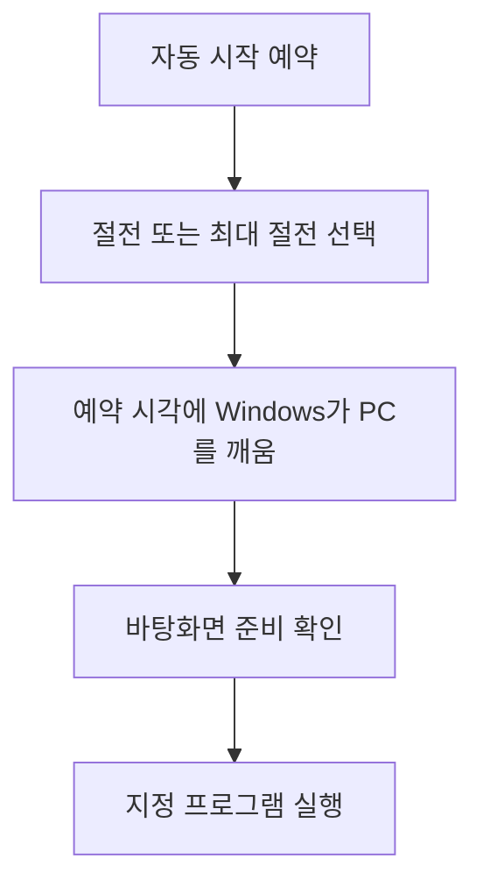
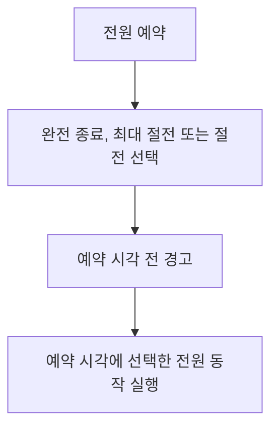

# eslee Auto Power

eslee Auto Power는 원하는 시간에 PC를 깨우거나 완전 종료, 최대 절전, 절전을 예약할 수 있는 Windows 11 앱입니다. PC가 깨어난 뒤 지정한 프로그램을 자동으로 실행할 수도 있습니다.

문서 언어: **한국어** · [English](README.en.md)

## 최신 설치 파일 다운로드

[GitHub Releases의 최신 릴리스](https://github.com/esleeeeee/eslee-auto-power/releases/latest)에서 파일 이름이 `-ko-setup.exe`로 끝나는 한국어 설치 파일을 받으세요.

`Source code (zip)`과 `Source code (tar.gz)`는 개발용 소스 파일이며 설치 프로그램이 아닙니다. 일반 사용자는 `-ko-setup.exe` 파일을 실행하면 됩니다.

이 앱은 Windows 11 x64 전용입니다.

## 이 프로그램으로 할 수 있는 일

- 아침이나 정해진 시간에 PC를 미리 깨우기
- 1시간 또는 2시간 뒤 PC를 자동으로 완전히 끄기
- 원하는 시각에 최대 절전 또는 절전으로 전환하기
- PC가 깨어난 뒤 지정한 업무 프로그램 실행하기
- 필요한 예약과 실행 결과를 한 화면에서 확인하기


## 처음 사용하는 방법

자동 시작 예약의 기본 순서는 다음과 같습니다.

> 설치 → 호환성 확인 → 새 예약 → 자동 시작 선택 → 날짜와 시간 선택 → 절전 또는 최대 절전 선택 → 예약 저장 → PC를 선택한 상태로 전환

1. 설치 후 eslee Auto Power를 실행합니다.
2. 왼쪽의 `호환성`을 열어 이 PC에서 절전과 최대 절전 예약 깨우기를 사용할 수 있는지 확인합니다. 가능한 방식은 실제 깨우기 테스트로 확인하는 것을 권장합니다.
3. `예약`에서 `+ 새 예약`을 누릅니다.
4. 동작으로 `자동 시작 예약`을 선택합니다.
5. 날짜와 시간을 지정합니다.
6. `자동 선택 (추천)`, `절전 (S3)` 또는 `최대 절전 (S4)` 중 사용할 방식을 선택합니다.
7. `저장`을 누릅니다.
8. 저장 직후 표시되는 안내에 따라 PC를 선택한 전원 상태로 전환합니다. 나중에 메인 화면의 `지금 S3 절전` 또는 `지금 S4 최대 절전`을 눌러도 됩니다.

절전이나 최대 절전으로 전환하기 전에 저장하지 않은 작업을 먼저 저장하세요.


### 선택 기능: 앱 관리형 1회 자동 로그인

Windows가 깨어난 뒤 잠금 화면을 한 번 건너뛰고 싶을 때만 사용합니다. 모든 사용자에게 필요한 설정은 아닙니다.

- 예약에서 `앱 관리형 1회 자동 로그인`을 선택할 때만 계정 설정이 필요합니다.
- `설정`에서 Windows 사용자 이름과 **Windows 계정 암호**를 저장하고 검증합니다.
- Windows Hello PIN은 저장하거나 사용하지 않습니다.
- 다음 복귀 한 번에만 적용되며, 물리적으로 안전한 PC에서 사용하는 것이 좋습니다.

## 정해진 시간에 PC 깨우기

자동 시작을 사용하려면 예약을 저장하는 것만으로는 충분하지 않습니다. 예약 시각 전에 PC를 예약과 같은 방식의 절전 또는 최대 절전 상태로 두어야 합니다.

1. `+ 새 예약`에서 `자동 시작 예약`을 선택합니다.
2. 날짜, 시간과 전원 방식을 선택하고 `저장`을 누릅니다.
3. 메인 화면에서 예약과 같은 `지금 S3 절전` 또는 `지금 S4 최대 절전`을 누릅니다.
4. 예약 시각이 되면 Windows가 PC를 깨웁니다.
5. 바탕화면이 준비되면 연결된 프로그램이 지정한 순서와 지연 시간에 따라 실행됩니다.

`자동 선택 (추천)`은 호환성 확인 결과를 바탕으로 사용할 수 있는 방식을 고릅니다. 특정 방식을 직접 선택했다면 메인 화면에서도 같은 상태로 전환하세요.

완전히 종료된 PC는 이 앱으로 다시 켤 수 없습니다. 자동 시작을 사용하려면 절전 또는 최대 절전 상태로 두세요.

## 나중에 PC 끄기, 최대 절전, 절전 예약하기

1. `+ 새 예약`을 누릅니다.
2. `예약 시각에 완전 종료`, `예약 시각에 최대 절전 진입` 또는 `예약 시각에 절전 진입`을 선택합니다.
3. 원하는 날짜와 시간을 입력하고 `저장`을 누릅니다.

새 예약 화면에서 세 동작 중 하나를 선택하면 `1시간 뒤`와 `2시간 뒤` 버튼도 사용할 수 있습니다. 버튼을 누른 현재 로컬 시각을 기준으로 예약 시간이 입력되며, 날짜와 시간은 저장 전에 다시 수정할 수 있습니다.

예약한 전원 동작은 실행 5분 전에 경고합니다. 경고를 닫거나 응답하지 않으면 원래 예약대로 진행됩니다.

## 트레이에서 빠르게 완전 종료 예약하기

앱 창을 닫아 트레이에서만 실행 중일 때도 사용할 수 있습니다.

1. 작업 표시줄 알림 영역의 eslee Auto Power 아이콘을 우클릭합니다.
2. `1시간 후 완전 종료` 또는 `2시간 후 완전 종료`를 클릭합니다.
3. 확인창 없이 완전 종료 예약이 만들어집니다.
4. 실제 예약 시각이 트레이 알림으로 표시됩니다.

빠른 메뉴는 PC를 즉시 끄지 않습니다. 선택한 시간 뒤에 실행할 완전 종료 예약을 만듭니다.

## PC가 깨어난 뒤 프로그램 실행하기

자동 시작 예약에 후속 프로그램을 연결할 수 있습니다.

1. 자동 시작 예약을 만들거나 수정합니다.
2. `후속 프로그램`에서 `+ 추가`를 누릅니다.
3. 실행 파일과 바탕화면 준비 후 지연 시간을 지정합니다.
4. 필요한 경우 `고급 옵션`에서 `관리자 권한으로 실행`을 선택합니다.

지연 시간은 예약 시각이 아니라 Windows 바탕화면이 실제로 준비된 시점부터 계산합니다. 같은 지연 시간으로 여러 프로그램을 등록할 수 있으며, 한 프로그램이 실패해도 나머지는 계속 실행됩니다.

관리자 권한 실행은 신뢰할 수 있는 프로그램에만 사용하세요.

## 어떤 전원 상태를 선택해야 하나요?

| 사용 목적 | 추천 선택 | 알아둘 점 |
|---|---|---|
| 잠깐 자리를 비우고 빠르게 돌아오려는 경우 | 절전 (S3) | 복귀가 빠르지만 대기 중 전력을 사용합니다. 지원되는 PC에서는 자동 시작에 사용할 수 있습니다. |
| 몇 시간 이상 사용하지 않지만 나중에 자동 시작이 필요한 경우 | 최대 절전 (S4) | 전력 사용이 적고 작업 상태를 보존합니다. Windows 최대 절전 기능과 PC 지원이 필요합니다. |
| 이후 자동 시작이 필요 없고 PC를 완전히 끄려는 경우 | 완전 종료 (S5) | 이 앱으로 다시 켤 수 없습니다. |

PC마다 지원하는 절전 방식이 다를 수 있으므로 처음에는 `호환성` 화면을 확인하세요.


## 꼭 알아둘 점

- Windows 11 x64에서만 사용할 수 있습니다.
- 자동 시작 결과는 PC 펌웨어, Windows 깨우기 타이머 설정과 제조사 전원 정책에 따라 달라질 수 있습니다.
- 최대 절전 선택지가 없으면 Windows 최대 절전 기능이 꺼져 있거나 PC에서 지원하지 않는 상태일 수 있습니다.
- 완전 종료 뒤에는 자동 시작 예약이 PC를 다시 켤 수 없습니다.
- 절전, 최대 절전 또는 완전 종료 전에 저장하지 않은 작업을 확인하세요.
- 배포 설치 파일은 현재 코드 서명이 없어 Windows SmartScreen 경고가 표시될 수 있습니다.
- `앱 관리형 1회 자동 로그인`을 사용하면 예약 전에 PC를 직접 깨운 경우에도 잠금 화면이 생략될 수 있습니다.

## 작동 원리

### 자동 시작 예약



### 전원 예약



예약 저장, Windows 작업 등록, 실행 결과 복구와 같은 내부 처리에 관심이 있다면 [아키텍처 문서](docs/architecture.md)를 참고하세요.

## 문제 해결

### 예약 시각에 PC가 깨어나지 않습니다

- 예약에서 선택한 방식과 메인 화면에서 PC를 전환한 방식이 같은지 확인하세요.
- `호환성`에서 해당 방식의 실제 깨우기 테스트를 다시 실행하세요.
- 노트북은 전원 연결 여부에 따라 깨우기 타이머 정책이 달라질 수 있습니다.
- PC 제조사 BIOS/UEFI의 절전 및 깨우기 설정도 확인하세요.

### 절전 또는 최대 절전 선택지가 없습니다

`호환성`에서 현재 PC가 지원하는 상태를 확인하세요. 최대 절전이 꺼져 있으면 앱이 안내하는 방법으로 Windows 최대 절전 기능을 먼저 활성화해야 할 수 있습니다. 앱이 이 설정을 자동으로 바꾸지는 않습니다.

### Windows가 암호를 요구합니다

일반적인 Windows 잠금 화면 동작입니다. 로그인 후 앱을 계속 사용할 수 있습니다. 다음 자동 시작에서 잠금 화면을 한 번 건너뛰어야 할 때만 `앱 관리형 1회 자동 로그인`을 선택하고 `설정`에서 Windows 계정 암호를 등록하세요. Windows Hello PIN은 사용할 수 없습니다.

### SmartScreen 경고가 표시됩니다

현재 설치 파일에는 코드 서명이 없습니다. 공식 [GitHub Releases](https://github.com/esleeeeee/eslee-auto-power/releases/latest)에서 받은 파일인지 먼저 확인한 뒤 Windows의 `추가 정보`에서 실행 여부를 직접 결정하세요.

### 예약 생성이나 실행이 실패합니다

앱의 `기록`에서 실패 내용을 확인하세요. 더 자세한 정보는 `설정` 또는 `정보`의 `진단 로그 폴더 열기`에서 볼 수 있습니다. 로그는 `%ProgramData%\eslee\AutoPower\logs`에 저장됩니다. 공개 이슈에 첨부하기 전에 사용자 이름과 실행 파일 경로 같은 내용을 직접 확인하세요.

일반적인 문제는 [GitHub Issues](https://github.com/esleeeeee/eslee-auto-power/issues)에 재현 순서와 함께 남길 수 있습니다. 암호, 계정 이름이나 원본 진단 로그는 공개하지 마세요.

## 개인정보와 로컬 데이터

eslee Auto Power는 로컬에서만 동작합니다. 분석, 광고, 외부 텔레메트리 또는 자동 오류 전송 기능이 없습니다.

- 예약, 실행 기록, 호환성 결과와 진단 로그는 `%ProgramData%\eslee\AutoPower`에 저장됩니다.
- 선택 기능을 위해 등록한 Windows 계정 암호는 Windows 보호 저장소에 보관되며 SQLite DB나 로그에 평문으로 기록되지 않습니다.
- 진단 로그에는 오류 코드와 실행 파일 경로처럼 문제 해결에 필요한 로컬 정보가 포함될 수 있습니다.

자세한 내용은 [개인정보 안내](PRIVACY.md)와 [보안 정책](SECURITY.md)을 참고하세요.

## 개발자용 문서와 빌드

기술 문서:

- [아키텍처](docs/architecture.md)
- [검증 결과](docs/verification.md)
- [변경 이력](CHANGELOG.md)
- [보안 정책](SECURITY.md)
- [개인정보 안내](PRIVACY.md)

빌드 환경:

- Windows 11 x64
- .NET SDK 10.0.301
- 설치 프로그램 생성 시 Inno Setup 6

```powershell
dotnet restore .\AutoPower.sln
dotnet build .\AutoPower.sln -c Release
dotnet test .\tests\AutoPower.Tests\AutoPower.Tests.csproj -c Release
```

언어별 빌드는 `-p:AppLanguage=ko` 또는 `-p:AppLanguage=en`을 사용합니다. 설치 파일을 만들 때는 릴리스할 버전을 지정합니다.

```powershell
$releaseVersion = "x.y.z"
.\scripts\Build-Release.ps1 -Version $releaseVersion
```

저장소 구조:

```text
src/AutoPower.App       WPF UI와 트레이
src/AutoPower.Core      예약 모델, 정책, 검증, 언어 카탈로그
src/AutoPower.Data      SQLite 저장소
src/AutoPower.Windows   Windows 통합 기능
src/AutoPower.Helper    관리자 권한 명령 실행기
src/AutoPower.Agent     복귀 및 후속 프로그램 처리
tests/AutoPower.Tests   자동 테스트
installer               Inno Setup 정의
```

## 라이선스

[MIT License](LICENSE)
